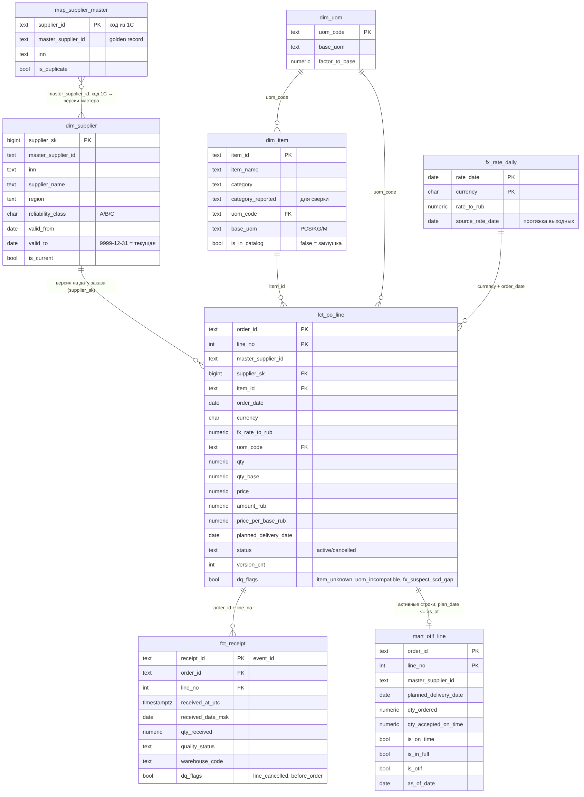

# Блок 2. Проектирование аналитического решения

Все цифры в этом файле посчитаны на выданном датасете. Запросы лежат в `03_sql/` (`dq_checks.sql`, `otif_ladder.sql`, `recon_turnover.sql`), результаты в `03_sql/results/`.

---

## 2.1. ER-диаграмма и выбор схемы

Диаграмма: [`02_model_er.mmd`](02_model_er.mmd) (Mermaid, GitHub рисует её сам) и картинка [`02_model_er.png`](02_model_er.png).



**Слои:** `raw` (CSV и события как есть, всё в `text`) → `stg` (типы, дедупликация, флаги качества) → `dm` (звезда и витрины). В прототипе stg-логика собрана в `02_transform.sql`, в проде это были бы модели dbt с тестами.

**Почему звезда (Кимбалл), а не Data Vault и не одна широкая таблица:**
- Первый релиз длится 4 недели, разработчик один. Звезда — самый короткий путь от источника до дашборда, и её понимают и BI, и LLM-слой AI4BI. Если отдать модели схему из 8 таблиц с понятными связями, она будет писать SQL заметно точнее, чем по Data Vault с хабами, линками и сателлитами.
- Факта два, и у них разное зерно: **строка заказа** (что обещали и почём) и **событие приёмки** (что и когда реально пришло). Склеивать их в один факт нельзя. На одну строку приходится от 0 до 3 приёмок, и при JOIN сумма заказа умножится. Поэтому два факта, а OTIF считается отдельной витриной на зерне строки заказа. Связь «приёмка → строка заказа» — осознанная связь факт–факт через вырожденное измерение `(order_id, line_no)`: поставщик, позиция и цена приёмки берутся из строки заказа, а не дублируются в событии.
- Data Vault оправдан при 10+ источниках и частой смене схем. У нас три источника (1С, WMS, SRM), и он добавил бы месяц работы без пользы для заказчика. Если домен разрастётся, звезду можно будет пересобрать поверх DV-слоя, и витрины при этом не поменяются.
- Отдельная мастер-карта `map_supplier_master` нужна потому, что справочник контрагентов грязный (см. дефект D1). Склейку дублей лучше держать явной таблицей, которую заказчик может проверить и поправить, а не прятать в SQL.

---

## 2.2. Зерно каждой таблицы

| Таблица | Одна строка = |
|---|---|
| `dm.dim_uom` | одна единица измерения |
| `dm.map_supplier_master` | один код поставщика из 1С, привязанный к своему мастер-поставщику |
| `dm.dim_supplier` | одна версия атрибутов мастер-поставщика (имя, регион, класс) на интервале `[valid_from, valid_to]` |
| `dm.dim_item` | одна позиция номенклатуры, включая заглушки для позиций, которых нет в справочнике |
| `dm.fx_rate_daily` | валюта × календарный день, включая выходные (курс протянут) |
| `dm.fct_po_line` | одна строка заказа (`order_id`, `line_no`) в последней версии по `updated_at` |
| `dm.fct_receipt` | одно событие приёмки (`receipt_id` / `event_id`) |
| `dm.mart_otif_line` | одна активная строка заказа с плановой датой поставки ≤ даты расчёта |
| Q1 (результат) | мастер-поставщик × календарный месяц |
| Q2 (результат) | позиция × ЕИ закупки × поставщик за квартал |
| Q3 (результат) | категория × мастер-поставщик за 12 месяцев |
| `mart_price` (план, релиз 1) | позиция × ЕИ закупки × мастер-поставщик × месяц: Σ сумм, Σ кол-ва в базовых ЕИ, число строк |
| `mart_turnover` (план, релиз 1) | категория × мастер-поставщик × месяц: заказано, принято без брака, отменено |
| `mart_dq` (план, релиз 1) | проверка качества × дата загрузки: число строк с дефектом, доля, порог |

DDL для трёх плановых витрин в прототипе не писал: их логика уже есть в Q2, Q3 и `dq_checks.sql`, на защите покажу, как они из них получаются.

---

## 2.3. DDL

Полный DDL: [`03_sql/01_ddl.sql`](03_sql/01_ddl.sql). Он реально исполняется в PostgreSQL 16, весь прогон делает `03_sql/run_all.sh`. Главное:

```sql
create table dm.fct_po_line (
    order_id text, line_no int,
    master_supplier_id text not null,
    supplier_sk bigint references dm.dim_supplier,      -- версия поставщика на дату заказа
    item_id text not null references dm.dim_item,
    order_date date not null, currency char(3) not null,
    fx_rate_to_rub numeric(18,6) not null,
    uom_code text not null references dm.dim_uom,
    qty numeric(18,4) not null check (qty > 0),
    qty_base numeric(18,4),                              -- NULL, если ЕИ несовместима
    price numeric(18,4) not null, amount_rub numeric(20,2) not null,
    price_per_base_rub numeric(18,6),
    planned_delivery_date date not null,
    status text not null check (status in ('active','cancelled')),
    version_cnt int not null,
    dq_item_unknown bool, dq_uom_incompatible bool, dq_fx_suspect bool, dq_supplier_scd_gap bool,
    primary key (order_id, line_no)
);
create index on dm.fct_po_line (master_supplier_id, planned_delivery_date);  -- OTIF по поставщику
create index on dm.fct_po_line (item_id, order_date);                        -- цены по позиции
create unique index on dm.dim_supplier (master_supplier_id) where is_current; -- одна текущая версия
```

Для денег и количеств везде `numeric`, а не `float`. При сверке на pandas это проявилось: 53,7 + 97,82 во float = 151,51999…, а не 151,52 (строка PO500016/1), и проверка «принято ≥ заказано» ложно падает. В выгрузке таких строк 1 096 (метод подсчёта — в конце `03_sql/verify_pandas.py`, подробности — AI_LOG, случай 4).

---

## 2.4. Как обрабатываю сложные случаи

### Историчность поставщика — SCD Type 2
- В справочнике уже есть версии (`valid_from`/`valid_to`/`is_current`): у 15 поставщиков менялось название, у 11 из них — ещё и класс надёжности (например, S1010 был C, с 22.08.2024 стал A).
- **Почему SCD2, а не SCD1:** класс надёжности — это оценка поставщика, и на неё смотрят во времени. Если перезаписать класс (SCD1), прошлогодний OTIF поставщика C внезапно окажется у поставщика A, и в отчёте «OTIF по классам» прошлые периоды поменяются задним числом. Директор не поверит отчёту, цифры которого прыгают сами по себе. Как раз от этого заказчик сейчас и страдает.
- В факте хранится `supplier_sk`, то есть версия на дату заказа. Для отчётов «на сегодня» есть `is_current`. Q1 берёт класс на последний день периода, чтобы отчёт был воспроизводим.
- **Дубли.** Сначала строю мастер-карту: по ИНН, мастером становится код с самой ранней историей. Историю версий беру от мастер-кода. Конфликты между мастером и дублем (S1050 = A, а его дубль S1128 = C) не решаю сам, они вынесены в вопросы заказчику.
- Хеш-сравнение атрибутов при загрузке: изменилось имя, регион или класс → закрываю старую версию и открываю новую. SCD2 и для переименований, и для смены класса: переименования редкие, хранить их дёшево, а для сверки с документами нужно имя на дату.

### Мультивалютность
- Курс берётся на **дату заказа**: это дата фиксации цены в документе. Сумму в рублях храню в факте (`amount_rub`) вместе с курсом (`fx_rate_to_rub`), чтобы её можно было проверить.
- ЦБ не публикует курс на выходные, в выгрузке нет суббот и воскресений. 199 валютных заказов сделаны в выходные, и inner join с курсами молча выкинул бы их из оборота. Поэтому курс **протягивается** на каждый календарный день, а `source_rate_date` показывает, с какой даты он взят.
- RUB лежит в таблице курсов явно с курсом 1, поэтому JOIN везде inner и без `coalesce`.
- Финансы, скорее всего, считают по курсу на дату приёмки или оплаты. Это возможный источник части расхождения 8–10%, вопрос к заказчику.
- **CNY:** после пересчёта цены в юанях в **7 раз ниже** рублёвых на ту же позицию (медиана отношения 0,140; у USD 0,987). Отношение 0,140 почти совпадает со средним кросс-курсом CNY/USD за период (0,148): похоже, цены в этих заказах введены в долларах, а валюта стоит CNY. Если это так, оборот 2025 года занижен на 1,6 млрд ₽ (4,3%, `recon_turnover.sql`, строка 4c). Строки помечены `dq_fx_suspect`, из ценовых сравнений исключены до ответа 1С, в обороте оставлены как есть.

### Разные единицы измерения при сравнении цен
- `qty_base = qty × factor_to_base`, `price_per_base = price × курс / factor_to_base`. Пересчёт возможен только внутри одной базовой единицы (PACK6/12/24 → PCS, TON → KG, ROLL50 → M). Если ЕИ строки несовместима с базовой ЕИ карточки (килограммы против штук), ставлю флаг `dq_uom_incompatible`, а `qty_base` остаётся NULL. Так я не придумываю коэффициент, которого нет.
- **Что выяснилось на данных:** в 31 397 строках (59% всех строк, 62% строк с позицией из справочника) ЕИ несовместима с карточкой, и при этом цена строки вообще не зависит от упаковки: медиана около 20 тыс. ₽ и за KG, и за TON, и за PCS, и за PACK24. Если честно поделить на коэффициент, получится «тонна в 1000 раз дешевле килограмма», и весь топ ценовых аномалий займут фиктивные −99,9%. Так выглядела первая версия Q2 (AI_LOG, случай 1).
- **Решение в Q2:** сравниваю позицию в одной и той же ЕИ закупки. Цену показываю за базовую единицу, а процент отклонения от коэффициента не зависит. Когда 1С подтвердит связку «ЕИ ↔ цена», ключ сравнения меняется в двух местах запроса (помечены `-- [KEY]`).
- **Честное ограничение:** цена в выгрузке не зависит и от позиции: коэффициент вариации цены внутри одной позиции 0,58, по всему массиву тоже 0,58 (D16). Поэтому Q2 методически корректен, но его выдача на этих данных — шум. Ковалёвой я бы её не показывал до ответов 1С по вопросам 4–5.

### Отмены и изменения строк заказа
- **Полные дубли** (1 591 лишняя строка) — артефакт выгрузки, удаляю `distinct`.
- **Версии** (805 строк, у которых две разные записи): беру последнюю по `updated_at`, сколько было версий, храню в `version_cnt`. В проде вместо полной перезаливки делаю инкремент по `updated_at` с перекрытием в 3 дня и upsert по `(order_id, line_no)`. Историю версий храню в `stg` для аудита.
- **Нюанс:** в 704 из 805 изменённых строк приёмка совпадает с количеством **первой** версии, а не последней. Похоже, изменение в 1С не доходит до поставщика. Это меняет In-Full примерно для 1,5% строк. Пока считаю по последней версии (это действующий документ) и задаю вопрос Пономарёву.
- **Отменённые строки** (`cancelled`) остаются в факте, но не входят ни в оборот «заказано», ни в знаменатель OTIF.
- По отменённым строкам пришло 749 приёмок. Товар физически приехал, и финансы его, скорее всего, оплатят. Момент отмены в выгрузке неизвестен (`updated_at` — время последнего изменения строки, а не отмены), поэтому «приехало до или после отмены» не утверждаю. Эти приёмки помечены `dq_line_cancelled` и идут в отдельный контрольный список.

### Позиции, которых нет в справочнике
- 40 позиций, 2 846 строк, около 5% оборота. Обычный `join` со справочником их молча теряет, и это ещё один кандидат в объяснение расхождения с финансами.
- Решение: строка-заглушка в `dim_item` (`is_in_catalog = false`, категория «(нет в справочнике)»). Факты не теряются, в Q3 такие позиции видны отдельной категорией, а итоги сходятся с общим оборотом.
- В DQ-отчёт уходит список позиций с оборотом, владелец справочника (по встрече — Пономарёв) их классифицирует. После этого заглушка заменяется настоящей карточкой при следующей загрузке, и пересчитывать ничего не нужно.

---

## 2.5. Матрица метрик

Общее для всех метрик: поставщик = мастер-поставщик (дубли склеены), строки заказа берутся в последней версии, суммы в рублях по курсу на дату заказа, «сегодня» = 12.08.2026.

| Метрика | Бизнес-определение | Зерно | Источники | Формула | Подводные камни |
|---|---|---|---|---|---|
| **OTIF** | Доля строк заказа, которые поставщик привёз вовремя, в полном объёме и без брака | строка заказа; агрегаты по поставщику × месяц плановой даты | 1С (строки), WMS (приёмка) | `avg(is_otif::int)` (доля строк с `is_otif = true`; не `count(is_otif)` — он считает и `false`), где `is_otif` = Σ qty со статусом `accepted` и датой приёмки (МСК) ≤ плановой даты ≥ заказанному кол-ву | UTC→МСК (730 ложных «вовремя»); NULL при отсутствии приёмки: `avg` по NULL их теряет; partially_rejected без принятого кол-ва; версии строк; дубли поставщиков |
| On-Time | Доля строк, где последняя приёмка была не позже плановой даты | строка заказа | 1С, WMS | `max(дата приёмки МСК) <= planned_delivery_date` | Нет приёмки — это не «вовремя», а промах. Ранняя поставка — вовремя |
| In-Full | Доля строк, по которым принято не меньше заказанного (в любой срок) | строка заказа | 1С, WMS | `Σ qty accepted >= qty` | Перепоставка не штрафуется (отдельная метрика при необходимости); float-сравнение |
| Оборот закупок (заказано) | Сколько мы заказали у поставщиков за период | строка заказа → период по дате заказа | 1С, курсы ЦБ | `Σ qty × price × курс` по активным строкам | Дубли строк +3%, старые версии, отмены, выходные без курса, inner join на справочник −5% |
| Оборот по приёмке (принято) | Стоимость фактически принятого товара | событие приёмки → период по дате приёмки | WMS, 1С, курсы | `Σ qty_received × price × курс`, без `rejected` | Включает приёмку по отменённым строкам; `partially_rejected` без принятого кол-ва (D14) — от его учёта зависит разница с «заказано»: 8,5–15%, отсюда спор с финансами |
| Средневзвешенная цена за базовую ЕИ | Сколько в среднем платим за 1 шт/кг/м позиции у поставщика | позиция × поставщик × период | 1С, ЕИ, курсы | `Σ amount_rub / Σ qty_base` | Нельзя `avg(price)`; несовместимые ЕИ; цена не масштабируется с упаковкой (D9); CNY |
| Ценовое отклонение от рынка | Насколько наша цена у поставщика выше медианы других поставщиков той же позиции | позиция × ЕИ закупки × поставщик × квартал | как выше | `wavg / median(wavg других) − 1`; деньги = `(wavg − медиана) × qty_base` | Медиана «других», а не всех; минимум 2 других поставщика; сравнивать в одной ЕИ |
| Отклонение от плановой цены (PPV) | Переплата или экономия относительно плановой цены | строка заказа | 1С (`plan_price`) | `Σ (price − plan_price) × qty × курс` | Откуда берётся план (договор SRM или ручной ввод) — вопрос; за 12 мес. строки выше плана дали 1,26 млрд ₽ |
| Доля брака | Какая доля принятого количества отбракована | событие приёмки → поставщик × месяц | WMS | `Σ qty rejected / Σ qty_received` | `partially_rejected` без разбивки; нужно `qty_accepted` в событии |
| Срок поставки (lead time) | Сколько дней от заказа до последней приёмки | строка заказа | 1С, WMS | `max(дата приёмки МСК) − order_date` | 1 103 приёмки раньше даты заказа (оформление задним числом), отрицательные сроки отбрасываю и вывожу отдельно |
| Концентрация поставщиков | Сколько поставщиков дают 80% оборота категории | категория × поставщик | 1С | накопленная доля по убыванию; считаем, пока доля ДО поставщика < 80% | Окно `ROWS`, а не `RANGE` (одинаковые суммы); без склейки дублей доля делится пополам |
| Доля аварийных и срочных заказов | Какая доля заказов делается не по плану | заказ | 1С (`order_type`) | `avg((order_type in ('Аварийная','Срочная'))::int)` по заказам, у которых есть строки (D17) | Сейчас 66,8%. Нужно уточнить, как в 1С выбирается тип и не ставят ли «срочную» по умолчанию |

### Спор «94% против 71%»: откуда обе цифры

Я посчитал на одной и той же выгрузке десять определений, которые встречаются на практике (`03_sql/otif_ladder.sql`, строки с плановой датой в феврале–июле 2026):

| # | Как считают | Результат |
|---|---|---|
| 1 | Строка хоть как-то поставлена (есть приёмка) | **93,1%** |
| 2 | Доля событий приёмки без брака | 89,6% |
| 3 | In-Full в любой срок | 79,4% |
| 4 | Вовремя по первой приёмке (пришла первая партия) | 67,1% |
| 5 | Вовремя по последней приёмке, допуск +7 дней | **73,3%** |
| 6 | То же, допуск +3 дня | 67,9% |
| 7 | То же, без допуска | 52,1% |
| 8 | OTIF, `partially_rejected` засчитан целиком | 49,9% |
| 9 | OTIF с датой приёмки в UTC (ошибка часового пояса) | 46,6% |
| 10 | **OTIF по моему определению** | **45,5%** |

**Гипотеза, которую проверю с обеими командами (вопрос 1 в `01_discovery.md`), — пока я не видел их формул, это объяснение, а не факт:**
- **94% логистики**, скорее всего, — «поставка состоялась»: приёмка была, без оглядки на дату и количество (строки 1–2). Склад видит машину и считает её успехом. Это метрика работы склада, а не надёжности поставщика.
- **71% категорийщиков**, скорее всего, — «вовремя» с допуском в несколько дней или по первой партии, без учёта полноты и брака (строки 4–6).
- Если гипотеза подтвердится, обе цифры честные, но отвечают на разные вопросы. Смирнов спрашивает, **кто из поставщиков нас подводит**, а это строгий OTIF: вовремя **и** полностью **и** без брака, к той дате, которую обещал поставщик. Сейчас он около **46%**, ниже обеих цифр. Это неприятная новость, и её надо говорить заранее, а не на правлении (сказано в письме Смирнову).
- 45,5% — консервативная цифра: каждое спорное решение тянет её вниз. Если засчитать частичную отбраковку — 49,9%. Если дать допуск +3 дня — 58,6%, +7 дней — 63,0%. Допуск +3 дня вместе с частичной отбраковкой — 64,7%. То есть честная вилка — **45–65%**, и окончательную цифру определит ответ Смирнова на вопрос 2. Важно, что любая из них ниже 94% и большинство ниже 71%.
- Предложение: OTIF = строка 10 как основная метрика, On-Time и In-Full рядом как её составляющие. Так сразу видно, что «тянет вниз»: сроки (52%) или объём (79%). Допуск в днях задаётся параметром, по умолчанию 0, решение за Смирновым.

---

## 2.6. Что не так с данными

Все проверки: [`03_sql/dq_checks.sql`](03_sql/dq_checks.sql), результат: [`03_sql/results/dq_checks.csv`](03_sql/results/dq_checks.csv). Дефектов 17 (D1–D17); D8 и D9 — одна проблема с ЕИ, поэтому в таблице 16 строк. Первые семь сильнее всего влияют на цифры.

| # | Дефект | Как обнаружил | Как влияет на дашборд | Как обрабатываю в пайплайне |
|---|---|---|---|---|
| D1 | **Дубли поставщиков**: 8 ИНН заведены под двумя кодами (S10xx и S1121–S1128). У дублей везде регион «Москва», карточки открыты в середине 2024 года, а заказы по ним идут с января 2024. Оба кода живут параллельно до сих пор (у S1128 47 заказов в 2026 году), то есть это не только наследие миграции, о которой говорил Пономарёв: дубли продолжают использоваться | `group by inn having count(distinct supplier_id) > 1` | Оборот и OTIF реального поставщика делятся на два кода, доля в категории занижена вдвое, рейтинг врёт. По дублям 190 заказов до начала действия карточки, их SCD2-join теряет (D13) | Мастер-карта по ИНН, мастер = код с самой ранней историей; все метрики по `master_supplier_id`. Конфликты классов (S1050 = A, S1128 = C) отдаю на решение заказчику. Риск правила «по ИНН»: у кодов-дублей совсем другие названия (S1121 «ПромСнаб-1» против S1001 «ВолгаТех-1»), а у части версий форма «ИП» при 10-значном ИНН (у ИП ИНН 12-значный). Это может быть и опечатка в ИНН, а не дубль, поэтому склейку подтверждает владелец справочника (вопрос 6) В DQ-отчёте пары кодов для чистки в 1С |
| D2 | **Полные дубли строк заказа**: 1 591 лишняя строка | `count(*)` против `count(distinct ...)` по всем полям | Оборот +3% только из-за дублей. При JOIN с приёмками удваивается и количество | `distinct` в stg + тест уникальности `(order_id, line_no)` в dm |
| D3 | **Версии строк**: 805 строк с двумя разными состояниями (qty, price). В 704 из них приёмка совпадает с **первой** версией | `count(*) > 1` после `distinct`, затем сверка с суммой приёмок | Без дедупа строка считается дважды (оборот +1,3%). Если взять последнюю версию, OTIF по ~1,5% строк меняется в зависимости от трактовки | Последняя по `updated_at`, `version_cnt` для аудита. Вопрос заказчику: какая версия обязательна для поставщика |
| D4 | **Позиции не в справочнике**: 40 позиций, 2 846 строк, ~5% оборота | anti-join `po_lines` → `items` | Inner join тихо срезает 5% оборота, это кандидат в объяснение расхождения с финансами | Заглушка в `dim_item`, категория «(нет в справочнике)», список в DQ-отчёт владельцу НСИ |
| D5 | **Разные часовые пояса**: приёмка в UTC, плановая дата и заказы в МСК | Перевод `received_at_utc` в МСК: 7 914 приёмок меняют календарную дату | 730 опоздавших поставок засчитываются как «вовремя», OTIF завышен на ~1 п.п. На дашборде по дням графики сдвигаются | `received_date_msk` считается в stg один раз, сравнение с плановой датой только по МСК |
| D6 | **Курсов нет на выходные** | anti-join валютных заказов к курсам | 199 валютных заказов при inner join выпадают из оборота, при left join получает сумму NULL | Протяжка курса на каждый календарный день, `source_rate_date` для аудита |
| D7 | **Цены в CNY выглядят не в той валюте**: в 7 раз ниже рынка после пересчёта, а USD сходится до 1% | Отношение «цена × курс / рублёвая медиана той же позиции в той же ЕИ»: CNY = 0,140, USD = 0,987. 0,140 ≈ кросс-курс CNY/USD (0,148) — вероятно, цены в долларах | В отчёте «где переплачиваем» поставщики в юанях стали бы «чемпионами экономии». Если цены в USD, оборот 2025 занижен на 1,6 млрд ₽ (4,3%) | Флаг `dq_fx_suspect`, исключение из ценовых сравнений до подтверждения 1С, в обороте как есть с пометкой |
| D8–D9 | **ЕИ строки ненадёжна**: в 59% строк (31 397) несовместима с карточкой (кг против шт), и цена не зависит от упаковки (тонна ≈ килограмм ≈ 20 тыс. ₽). Ещё 99% «штучных» строк имеют дробное количество (143,6 шт) | Сравнение базовой ЕИ строки и карточки; медиана цены по ЕИ строки | Цена «за базовую единицу» превращается в мусор: первая версия Q2 выдала «−100%, эффект −6 млрд ₽» на закупках в 0,4 млн | Флаг `dq_uom_incompatible`; Q2 сравнивает внутри одной ЕИ закупки. Главный вопрос к Пономарёву: какое поле ЕИ попало в выгрузку |
| D10 | **Приёмка по отменённым строкам**: 749 событий | Join приёмок с последней версией строки | Если считать оборот по приёмке, отменённые строки в него попадают; в OTIF их нет. Это ещё один источник «двух правд» | Флаг `dq_line_cancelled`, отдельный контрольный список для закупок |
| D11 | **Приёмка раньше заказа**: 1 103 события, до 4 суток | `received_at` (МСК) < `order_dttm_msk` | Отрицательный срок поставки; на OTIF не влияет (это «рано») | Флаг `dq_before_order`; из среднего срока поставки исключаю. Бизнес-находка: заказы оформляют задним числом |
| D12 | **Две категории у товара**: у 33 позиций `category` ≠ `category_reported` | Сравнение полей; `category` совпадает с названием позиции во всех 760 случаях | Разрезы по категориям зависят от того, какое поле взять | Беру `category` (совпадает с карточкой), `category_reported` храню для сверки со старыми отчётами |
| D13 | **Заказы вне срока действия карточки поставщика**: 190 | As-of join заказа к версиям | SCD2-join без мастер-карты оставит у них поставщика NULL | Версия ищется по мастер-коду, флаг `dq_supplier_scd_gap` |
| D14 | **`partially_rejected` без принятого количества**: 4 578 событий | Структура события: есть только `qty_received` | Нельзя честно посчитать In-Full и брак; OTIF колеблется 45,5–49,9% в зависимости от трактовки | Консервативно: не засчитываю. В контракте Kafka требую `qty_accepted` / `qty_rejected` |
| D15 | **Записи «из будущего»**: 121 изменение строк заказа (127 с полными дублями) с `updated_at` после даты выгрузки (до 18.08.2026) и 7 приёмок после 12.08 по МСК | `max(updated_at)` и `received_at` против даты выгрузки | Пересчёт истории «на дату» начинает знать будущее; версия строки может оказаться не той, что действовала 12.08 | Витрина OTIF не учитывает приёмки позже `as_of_date`. Для строк заказа отсечку по `updated_at` в прототипе не делал: «будущая» версия выбрана только у 2 строк, и на метрики это не влияет (плановые даты 17.08 и 04.09 — позже даты расчёта). В проде инкремент берёт версии с `updated_at` не позже момента снятия снимка. Вопрос к Пономарёву: выгрузка снималась позже или часы сервера сбиты |
| D16 | **Цена не зависит от позиции**: коэффициент вариации цены внутри позиции 0,58 — как по всему массиву | `stddev/avg` цены по позиции против общего | Любое сравнение цен между поставщиками (Q2, экран цен) на этих данных — шум | Q2 методически готов, но выдачу заказчику не показываю до ответа 1С (вопросы 4–5). Проверка D16 остаётся в DQ: на реальных данных она должна показать CV внутри позиции заметно ниже общего |
| D17 | **Шапки заказов без строк**: 3 572 из 21 292 (16,8%) — ни одной строки и ни одной приёмки. Вероятно, пилотный фильтр по категориям обрезал строки, а шапки оставил | anti-join `po_headers` → `po_lines` | Любые счётчики по шапкам завышены: число заказов, средний чек, доля срочных, «заказов в выходные» (261 вместо 199), «заказов вне карточки» (230 вместо 190) | Факт строится от строк, поэтому оборот и OTIF не затронуты. В stg заказом считается только шапка со строками, пустые уходят в DQ-отчёт. Вопрос к Пономарёву: это фильтр выгрузки или реальные пустые заказы в 1С |

**Ещё два наблюдения (не дефекты, но влияют на выводы):**
- В выгрузке 5 складов (WH-01…05), а по легенде их 12. Значит, это пилотный контур, и цифры нельзя экстраполировать на всю компанию.
- Оборот «заказано» и «принято» за 2025 год расходится на **8,5–15%** (`recon_turnover.sql`): 8,5–9,5%, если частичную отбраковку засчитать целиком, и 15,1%, если считать только `accepted` (принятое количество в событии неизвестно, D14). Нижняя граница того же порядка, что и разрыв, который не может объяснить Смирнов. Гипотеза: отчёт закупок считает «заказано», финансы — «принято / оплачено». Оговорки: даты разные (заказ против приёмки), так что часть разницы — переходящие заказы; а если цены «CNY» на самом деле в долларах, «заказано» вырастет ещё на 4,3%. Подтвердить или опровергнуть можно только по формулам обоих отчётов (вопрос 3).
