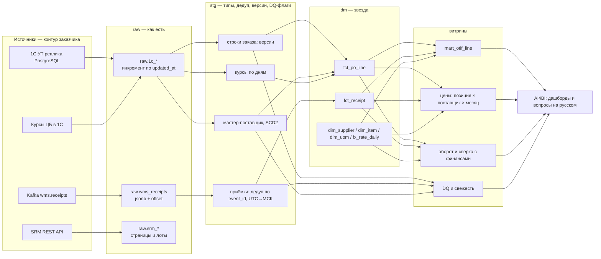

# Блок 4. Интеграции и пайплайны

## 4.1. ТЗ на загрузку из SRM API

### Контекст и цель
SRM содержит договоры и тендеры. На этапе 2 они нужны для двух вещей: «цена по договору vs фактическая цена в заказе» и «выбор поставщика по тендеру vs фактический поставщик». Загрузка идёт в слой `raw` (ответы API как есть, JSON), дальше в `stg` и `dm`, как и для 1С.

### Ограничения API (из документации заказчика)
- `/contracts`: есть `updatedFrom`, пагинация page/size (максимум 100), `X-Total-Count`.
- `/tenders`: **нет** `updatedFrom`, около 180 тыс. записей, сортировка по релевантности, порядок между вызовами не гарантирован.
- `/tenders/{id}/lots`: только поштучно.
- Лимит **100 запросов в минуту на токен**. OAuth2 client_credentials, токен живёт **15 минут**.

### Бюджет запросов

| Операция | Запросов | Время при 90 req/min |
|---|---|---|
| Полный проход по тендерам (180 000 / 100) | 1 800 | ~20 минут |
| Договоры, инкремент за сутки | обычно < 50 | < 1 минуты |
| Лоты, первичная загрузка (по 1 на тендер) | 180 000 | **~33 часа** |
| Лоты, ежедневный инкремент (новые и изменённые тендеры) | оценочно 1–3 тыс. | 10–35 минут |

Работаем на **90 req/min**, а не на 100: 10% запаса на повторы и чужие вызовы с того же токена. Ограничитель — один общий token bucket на все потоки загрузки, а не на каждый поток отдельно.

### Как делать инкремент для `/tenders` без `updatedFrom` и без стабильного порядка

1. **Сначала спросить вендора** (вопрос 11 в `01_discovery.md`). Нет ли недокументированных `sort=id` или фильтров по дате или статусу. Проверить на тестовом стенде. Если сортировка по id есть, задача сводится к обычному постраничному обходу.
2. **Если нет — ежедневный полный снимок с проверкой полноты.** 20 минут в сутки — это дёшево.
   - Обходим страницы 1…N (N = `ceil(X-Total-Count / 100)`), каждый ответ сохраняем в `raw.srm_tenders_page` (`run_id`, `page`, `fetched_at`, `payload jsonb`).
   - Нестабильный порядок значит, что запись может попасть на две страницы или не попасть ни на одну. Поэтому после прохода сравниваем **число уникальных id** с `X-Total-Count`.
   - Не хватает → делаем ещё проход и объединяем множества. Максимум 3 прохода, это ~60 минут.
   - Если за 3 прохода полноты нет: при наличии любого фильтра (статус, год создания) режем выборку на части по ≤ 100 записей. Часть, которая помещается на одну страницу, приходит целиком при любом порядке. Если фильтров нет, снимок помечается как «неполный», в `dm` применяются только изменения (новые и изменённые id), удаление по отсутствию не делаем, отправляется предупреждение.
3. **Выделение изменений из снимка.**
   - Для каждого тендера считаем хеш нормализованного JSON (ключи отсортированы, технические поля вроде `relevance` исключены).
   - Сравниваем с хешем из прошлого снимка: новый id → insert; хеш изменился → новая версия (SCD2 в `stg`), id в очередь на перезагрузку лотов.
   - id нет в двух **полных** снимках подряд → помечаем как удалённый. Физически не удаляем.

### Как уложиться в 100 req/min с поштучными лотами
- **Первичная загрузка лотов** — разовая фоновая задача на ~1,5 суток через очередь `srm_lots_queue (tender_id, status, attempts, last_error, loaded_at)`. Идёт параллельно с остальными работами недели 5, не блокирует договоры и тендеры: их бюджет, ~1 900 запросов в сутки, вычитаем первым.
- **Попросить у вендора** временно второй токен или повышенный лимит на время первичной загрузки. Это сократит её вдвое. Обходить лимит без согласования (несколько токенов «втихую») не будем: заблокируют клиента.
- **Ежедневно** лоты грузим только для тендеров, которые новые, изменились по хешу или в активном статусе (приём заявок, оценка). Закрытые тендеры, которые не менялись, раз в 30 дней перепроверяются скользящим окном (~6 тыс. в сутки, ~1 час).
- Ответ 429 → ждём `Retry-After`, если он есть, иначе экспоненциальная пауза 2, 4, 8… с, максимум 60 с, плюс случайный разброс.

### Протухший токен
- Токен получаем заранее и обновляем **проактивно** через 12 минут (80% TTL), не дожидаясь ошибки.
- На 401 → обновляем токен **один раз** и повторяем тот же запрос. Повторный 401 → это не протухание, а проблема прав: стоп и предупреждение.
- Обновление токена под блокировкой: если 5 потоков одновременно получат 401, токен обновится один раз, а не пять.
- Токен и client_secret — только в хранилище секретов (Vault или k8s secret), в логи не пишутся.

### Падение на 130-й тысяче
- **Ничего не начинается заново.** Состояние хранится в базе, а не в памяти процесса:
  - лоты — в очереди `srm_lots_queue`: обработанные 130 тыс. уже `done`, перезапуск берёт `pending`;
  - снимок тендеров — постранично в `raw.srm_tenders_page` с `run_id`: перезапуск продолжает тот же `run_id` с первой недостающей страницы, итог проверяется по полноте id.
- **Запись идемпотентна:** upsert по `tender_id` / `lot_id` + хеш. Повторная обработка той же страницы ничего не портит.
- **Публикация атомарна:** `stg` и `dm` обновляются только после завершения прогона и проверок (полнота, схема ответа, доля ошибок < 1%). Упавший прогон не оставляет витрину наполовину обновлённой: пользователи видят вчерашние данные с пометкой свежести.
- Ошибки по отдельным id (5xx после 5 попыток, битый JSON) уходят в отложенные (`status = 'failed'`, `last_error`) и не валят весь прогон. Их больше 1% → прогон помечается «частичным» и отправляется предупреждение.
- Метрики прогона: запросы, 429, 401, длительность, полнота. Предупреждения уходят в канал команды и дежурному ИТ заказчика.

### Критерии приёмки загрузки SRM
1. Число уникальных тендеров в `stg` = `X-Total-Count` ± 0 (или прогон помечен «неполным» с причиной).
2. Перезапуск после принудительного `kill` на середине прогона не создаёт дублей и не теряет записи.
3. За сутки не больше 100 запросов в минуту на токен (по логам), 429 < 1% запросов.
4. Искусственно протухший токен не прерывает прогон.

---

## 4.2. Контракт события приёмки `wms.receipts.v1`

### Что не так с событием as-is

| Поле as-is | Проблема |
|---|---|
| `ts` | Непонятно, что это: время приёмки, время отправки или время записи в Kafka. Для OTIF нужно время **фактической приёмки** |
| `order`, `line` | Ссылка на заказ есть, но нет `item_id`: не проверить, что приняли ту позицию |
| `qty` | Нет ЕИ: 40 штук или 40 упаковок по 24? |
| `status: accepted` | При частичной отбраковке нет разбивки «принято / брак» (в выгрузке 4 578 таких событий) |
| — | Нет `receipt_id` (документ приёмки), нет версии события, нет признака корректировки или отмены |
| — | Нет версии схемы |

### Требуемая схема (JSON Schema, draft 2020-12)

```json
{
  "$id": "wms.receipts/v2",
  "type": "object",
  "required": ["event_id", "event_type", "schema_version", "occurred_at", "produced_at",
               "receipt_id", "receipt_version", "warehouse_code", "order_id", "line_no",
               "item_id", "uom_code", "qty_received", "qty_accepted", "qty_rejected", "quality_status"],
  "additionalProperties": true,
  "properties": {
    "event_id":        {"type": "string", "format": "uuid", "description": "уникален для каждого события, ключ дедупликации"},
    "event_type":      {"enum": ["receipt.created", "receipt.corrected", "receipt.cancelled"]},
    "schema_version":  {"const": 2},
    "occurred_at":     {"type": "string", "format": "date-time", "description": "момент фактической приёмки, UTC, с 'Z'"},
    "produced_at":     {"type": "string", "format": "date-time", "description": "момент отправки в Kafka, UTC"},
    "receipt_id":      {"type": "string", "description": "документ приёмки в WMS"},
    "receipt_version": {"type": "integer", "minimum": 1, "description": "растёт при каждой корректировке документа"},
    "warehouse_code":  {"type": "string", "pattern": "^WH-\\d{2}$"},
    "order_id":        {"type": "string", "pattern": "^PO\\d+$"},
    "line_no":         {"type": "integer", "minimum": 1},
    "item_id":         {"type": "string"},
    "uom_code":        {"type": "string", "description": "ЕИ, в которой указано количество (справочник 1С)"},
    "qty_received":    {"type": "number", "exclusiveMinimum": 0},
    "qty_accepted":    {"type": "number", "minimum": 0},
    "qty_rejected":    {"type": "number", "minimum": 0},
    "quality_status":  {"enum": ["accepted", "partially_rejected", "rejected"]},
    "reject_reason":   {"type": ["string", "null"]}
  }
}
```
Инвариант: `qty_accepted + qty_rejected = qty_received`. Проверяется на стороне producer и повторно в нашем `stg`.

### Гарантии

| Аспект | Требование и почему |
|---|---|
| **Ключ партиционирования** | `order_id`. Все события одного заказа попадают в одну партицию и читаются по порядку. Распределение равномерное (21 тыс. заказов в пилоте). `warehouse_code` как ключ не подходит: 5–12 значений дают перекос партиций |
| **Гарантия доставки** | At-least-once: producer с `acks=all`, `enable.idempotence=true`. Exactly-once между системами всё равно не получить, поэтому дубли закрываем на нашей стороне |
| **Идемпотентность** | Мы храним `event_id` с уникальным ключом в `raw`; повтор — `on conflict do nothing`. В `stg` состояние документа = последняя `receipt_version` по `receipt_id` |
| **Out-of-order** | Порядок определяем по `receipt_version`, а не по времени прихода в Kafka и не по `occurred_at`: часы на складских терминалах могут врать. Пришла версия 2 раньше 1 → применяем 2, а 1 записываем в историю, но не применяем к состоянию (последняя запись побеждает по версии) |
| **Опоздавшие события** | Приёмка за прошлые дни пересчитывает OTIF только затронутых строк заказа. Месяц, уже показанный директору, не «плывёт» молча: изменения после закрытия месяца видны в отчёте «корректировки после закрытия» |
| **Корректировки и отмены** | `receipt.corrected` — новое состояние документа целиком (не дельта). `receipt.cancelled` → `qty = 0` в текущем состоянии, история сохраняется |
| **Версионирование схемы** | Schema Registry, режим BACKWARD: новые необязательные поля можно добавлять без смены версии. Ломающее изменение → новый топик `wms.receipts.v2` и период двойной публикации (v1 и v2) минимум 2 недели, пока мы не переключимся. Сейчас топик называется `.v1`, а нужная схема ломающая, отсюда и `v2` |
| **Retention** | Не меньше 7 дней, чтобы пережить простой нашего consumer на праздниках. Историю за прошлые годы берём из БД WMS, а не из топика |

### Что делаю **сейчас**, пока WMS не переделали формат
1. Читаю топик как есть в `raw.wms_receipts_v1`: `payload jsonb` + метаданные Kafka (`partition`, `offset`, `timestamp`). Порядок читаю сам, ничего не теряю.
2. Дедупликация по `event_id` (уникальный индекс). Если `event_id` нет или он пустой — по хешу `(order, line, ts, qty, status, warehouse)`.
3. Допущения, явно записанные в README и согласованные с ИТ:
   - `ts` = время приёмки в UTC (в примере есть `Z`). Перевожу в МСК для сравнения с плановой датой;
   - `qty` — в ЕИ строки заказа 1С. Каждую ночь проверяю: сумма приёмок по строке > 150% заказанного → подозрение на другую ЕИ, событие уходит в отложенные;
   - `partially_rejected` в OTIF не засчитываю целиком (консервативно). Это показано на экране как отдельное число, чтобы было видно, сколько OTIF «теряется» из-за отсутствия данных.
4. Ссылочная проверка: события с `order/line`, которых нет в 1С, уходят в отложенные и проверяются после следующей загрузки 1С. Заказ мог появиться позже приёмки: 1 103 приёмки в выгрузке раньше даты заказа.
5. Историю с 2024 года беру разовой выгрузкой из БД WMS (как в `receipts.csv`), а топик — для новых событий. Стык проверяю по `receipt_id` и дате.

---

## 4.3. Пайплайн целиком



| Источник | Периодичность | Способ |
|---|---|---|
| 1С (заказы, справочники) | Ночью, 02:00 МСК, плюс полная сверка контрольных сумм раз в неделю | Инкремент по `updated_at` с перекрытием 3 дня (документы в 1С проводят задним числом) |
| Курсы ЦБ | Ежедневно, 08:30 МСК (после публикации ЦБ и загрузки в 1С) | Из 1С, протяжка на выходные в `stg` |
| Kafka приёмки | Постоянно (consumer) в `raw`; пересчёт витрин раз в час с 08:00 до 20:00 | Микробатч |
| SRM (этап 2) | Ночью, 03:00 МСК (договоры + снимок тендеров), лоты по очереди | См. 4.1 |

**Оркестрация:** оркестратор, который используется в AI4BI на проекте (Airflow или аналог), трансформации — моделями dbt с тестами. Граф зависимостей: витрины строятся, только когда загружены все их источники и пройдены тесты.

**Что происходит при сбое ночной загрузки:**
1. Автоматический повтор 3 раза с паузой 15 минут: большинство сбоев сетевые или блокировки на реплике.
2. Витрины собираются в отдельной схеме и **подменяют** рабочие только после прохождения тестов: уникальность ключей, ссылочная целостность, контрольные суммы оборота с 1С ± 0,5%, доля строк с DQ-флагом не выросла скачком. Тест не прошёл → пользователи продолжают видеть вчерашние, но целые данные. Полуобновлённой витрины не бывает.
3. Предупреждение уходит сразу: в канал команды (разработчик, DevOps, я) и дежурному ИТ заказчика (Гареев назначит). В 08:30 я проверяю статус и до 09:00 пишу Ковалёвой и Смирнову, если данные несвежие и когда ожидаем.

**Как заказчик узнает, что данные неактуальны:**
- На каждом экране строка «Данные на: 12.08.2026 02:47 МСК» по каждому источнику.
- Если данные старше 26 часов (1С) или 3 часов (приёмки в рабочее время), строка становится красной с текстом «Обновление не прошло, показаны данные на …».
- Ответ AI4BI на вопрос на русском всегда содержит дату актуальности данных, а при устаревших данных — предупреждение в первой строке ответа.
- Отдельный экран «Качество данных»: свежесть, число отложенных событий, позиции без карточки, дубли контрагентов — с трендом. Его смотрим с Пономарёвым на еженедельном разборе.
